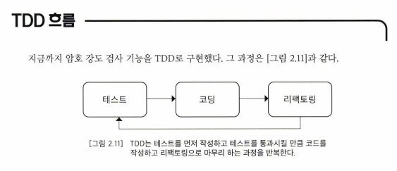

# 테스트 주도 개발 (TDD)
> TDD는 테스트부터 시작한다.
> 구현을 먼저 하고 나중에 테스트 하는 것이 아니라,
> **먼저 테스트를 하고 그 다음에 구현**한다.

#

### Chap01 : 테스트 개발환경 설정 (JUnit5)
 
이 책에서는 JUnit5 버전을 사용했으며, JUnit4 버전에 대한 소개는 뒤에서 하도록 한다.

#

### Chap02 : 테스트 주도 개발의 사이클
 

    
click

    

        

1. 기능을 검증하는 `테스트를 먼저 작성`
2. 작성한 테스트를 통과하지 못할 경우 테스트를 통과할 수 있도록 `코드 작성`
3. 테스트를 통과했다면 `리팩토링`
    

